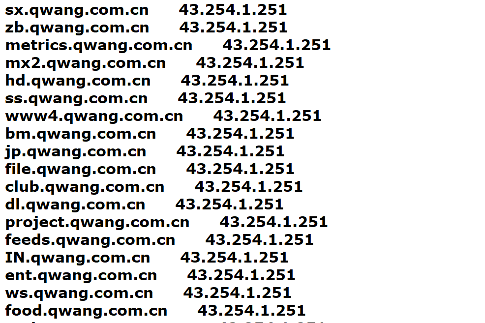

#  Iscan
一个简单的信息搜集工具，支持包括子域名爆破（主要），web指纹识别，whois查询（调用api），以及后续的对查询到的子域名信息进行处理，以及简单的端口扫描。使用`gevent`进行网络异步请求，效率还不错。

# Usage

```shell
    usage: iscan.py [-h] -d DOMAIN [-fc {y,n}] [-p PLUGINS]

    optional arguments:
    -h, --help            show this help message and exit
    -d DOMAIN, --domain DOMAIN
                            target domain
    -fc {y,n}, --force_check_port {y,n}
                            force check subdomain port
    -p PLUGINS, --plugins PLUGINS
                            choose the plugins you want to use
```

目前仅支持一些简单的命令，还不够完善。 `-fc`指定后续对子域名进行端口扫描。

# ScreenShot





# TODO

- 暂时cms识别还是调用网上的api，不太稳定。
- 还有就是爆破子域名模块中确定dns主机功能不太稳定，可能是网络问题（老家网太差），暂时手工指定。
- 后面考虑添加config目录，代码配置分离


**参考了很多前辈代码，学到了很多，春节无聊匆忙写出，大佬勿喷。**

[lijiejie](https://github.com/lijiejie/subDomainsBrute)
[yanxiu0614](https://github.com/yanxiu0614/subdomain3)


